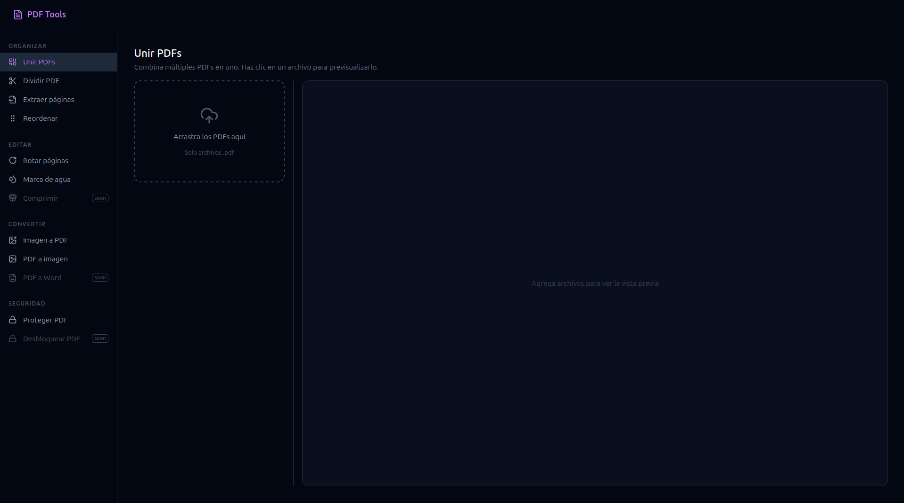

# PDF Tools



Herramienta web para manipulación de archivos PDF que corre completamente en el navegador. Sin subida a servidores — todo el procesamiento es local.

## Stack

- **React 19** + **TypeScript 6** + **Vite 8**
- **Tailwind CSS v4** — estilos
- **React Router DOM v7** — navegación
- **pdf-lib** — manipulación de PDFs (merge, split)
- **pdfjs-dist** — renderizado de páginas en canvas
- **Lucide React** — iconos

## Arrancar en desarrollo

```bash
npm install
npm run dev
```

## Herramientas disponibles

| Herramienta | Estado | Descripción |
|-------------|--------|-------------|
| Merge PDF | Funcional | Une múltiples PDFs en uno. Soporta reordenamiento con drag & drop. |
| Split PDF | Funcional | Divide un PDF por rangos de páginas definidos manualmente. |
| Extract | Pendiente | — |
| Reorder | Pendiente | — |
| Rotate | Pendiente | — |
| Watermark | Pendiente | — |
| Img to PDF | Pendiente | — |
| PDF to Img | Pendiente | — |
| Compress | Requiere backend | Necesita servidor Python para comprimir. |
| PDF to Word | Requiere backend | Necesita servidor Python (OCR). |
| Protect | Pendiente | — |
| Unlock | Requiere backend | Necesita servidor Python para remover contraseñas. |

## Arquitectura

Sigue el patrón de capas documentado en [docs/ARCHITECTURE.md](docs/ARCHITECTURE.md).

```
src/
├── domain/           # Tipos puros del negocio (PdfFile, Tool)
├── application/      # Contextos globales (vacío por ahora)
├── infrastructure/   # Servicios y use cases async
│   ├── services/     # pdfRenderer (canvas), pdfWorker (configuración de pdfjs)
│   └── useCases/     # mergePdfs, splitPdf
└── presentation/     # UI: layout, rutas, páginas y componentes
```

### Componentes UI compartidos

| Componente | Ubicación | Descripción |
|------------|-----------|-------------|
| `FileDropzone` | `presentation/components/ui/` | Drag & drop para cargar archivos PDF |
| `PdfViewer` | `presentation/components/ui/` | Visor completo con scroll y badge de página actual |
| `PdfPreviewGrid` | `presentation/components/ui/` | Grid de thumbnails de páginas |
| `ToolLayout` | `presentation/components/ui/` | Layout de dos paneles: controles + preview |

### Modelos de dominio

```ts
interface PdfFile {
  id: string
  file: File
  name: string
  size: number
  pageCount: number
  preview?: string  // thumbnail base64 de la primera página
}

type ToolStatus = 'available' | 'backend-required'

interface Tool {
  id: string
  label: string
  description: string
  path: string
  icon: string
  status: ToolStatus
  category: ToolCategory  // 'organize' | 'edit' | 'convert' | 'security'
}
```

## Scripts

```bash
npm run dev       # servidor de desarrollo
npm run build     # build de producción (tsc + vite build)
npm run preview   # previsualizar build
npm run lint      # ESLint
```
